# N8N Workflow - Autonomous AI Code Review Agent

## Overview
**Workflow name:** Autonomous AI Code Review Agent
**Trigger:** Schedule (every 30 minutes)
**Purpose:** Automatically reviews open GitHub Pull Requests using an AI model (EPAM DIAL / GPT-4o),
posts structured review comments back to GitHub, and sends real-time alerts to Microsoft Teams
with severity-based routing and persistent memory to avoid re-reviewing PRs.

## Workflow Diagram

## Workflow Flow

Schedule Trigger (every 30 min)
  -> Fetch Open Pull Requests  (GitHub API, max 10 open PRs)
  -> Extract & Filter New PRs  (JS: strips already-reviewed PRs from static memory)
  -> IF New PRs?
       YES -> Loop Over PRs (SplitInBatches, one PR at a time)
                -> Fetch PR File Diffs       (GitHub API: changed files + patches)
                -> Build Rich Review Prompt  (JS: formats PR metadata + diffs for LLM)
                -> DIAL API - AI Code Review (POST GPT-4o via EPAM DIAL proxy)
                -> Parse AI Review           (JS: extracts SEVERITY, SCORE, SUMMARY, ISSUES, SUGGESTIONS)
                -> IF Critical?
                     YES -> Build Critical Messages
                              -> GitHub - Post Critical Comment
                              -> Teams  - Critical Alert
                     NO  -> Build Normal Messages
                              -> GitHub - Post Normal Comment
                              -> Teams  - Review Summary
                -> Save Agent Memory  (persists reviewed PR IDs, lastRunAt, totalReviewed)
                -> (back to Loop Over PRs for next PR)
       NO  -> Teams - No New PRs  (lightweight notification and stop)

## Node Details

| # | Node | Type | Description |
|---|------|------|-------------|
| 1 | Schedule Trigger | Trigger | Fires every 30 minutes |
| 2 | Fetch Open Pull Requests | HTTP GET | GitHub API: open PRs with auth token |
| 3 | Extract & Filter New PRs | Code (JS) | Reads static memory, filters out reviewed PR IDs |
| 4 | IF New PRs? | IF | Branches: new PRs found vs nothing to do |
| 5 | Teams - No New PRs | HTTP POST | Teams webhook: agent ran, nothing new |
| 6 | Loop Over PRs | SplitInBatches | Iterates one PR at a time |
| 7 | Fetch PR File Diffs | HTTP GET | GitHub API: filenames, patches, line counts |
| 8 | Build Rich Review Prompt | Code (JS) | Assembles LLM prompt from PR data + diffs (800 chars/file) |
| 9 | DIAL API - AI Code Review | HTTP POST | EPAM DIAL (GPT-4o): structured code review |
| 10 | Parse AI Review | Code (JS) | Regex extraction of SEVERITY/SCORE/SUMMARY/ISSUES/SUGGESTIONS |
| 11 | IF Critical? | IF | Routes on isCritical flag |
| 12 | Build Critical Messages | Code (JS) | GitHub markdown + Teams Adaptive Card (urgent styling) |
| 13 | Build Normal Messages | Code (JS) | GitHub markdown + Teams card (standard styling) |
| 14 | GitHub - Post Critical Comment | HTTP POST | Posts formatted AI review as PR comment |
| 15 | Teams - Critical Alert | HTTP POST | Sends urgent red Adaptive Card to Teams channel |
| 16 | GitHub - Post Normal Comment | HTTP POST | Posts standard AI review as PR comment |
| 17 | Teams - Review Summary | HTTP POST | Sends standard summary card to Teams channel |
| 18 | Save Agent Memory | Code (JS) | Persists PR IDs in workflow static data (capped at 100) |

## AI Review Output Format

The LLM is instructed to return plain text in this exact structure:

  SEVERITY: CRITICAL | HIGH | MEDIUM | LOW
  SCORE: 7/10
  SUMMARY: One-sentence description of the PR.
  ISSUES: Description of problems found (or N/A).
  SUGGESTIONS: Specific actionable improvements.

CRITICAL severity triggers the urgent Teams alert and distinct GitHub badge.

## How to Import and Run

1. Start N8N locally:
   docker run -it --rm -p 5678:5678 -v ~/.n8n:/home/node/.n8n n8nio/n8n

2. Open http://localhost:5678

3. Go to Workflows -> Import from file

4. Select autonomous-ai-code-review-agent.json

5. Update credentials in these nodes before activating:
   - Fetch Open Pull Requests   : GitHub repo URL + Personal Access Token (Bearer)
   - DIAL API - AI Code Review  : DIAL endpoint URL + Api-Key header value
   - Teams nodes (x3)           : Microsoft Teams Incoming Webhook URL

6. Click Activate - runs automatically every 30 minutes.

## Prerequisites
- N8N running via Docker (n8nio/n8n)
- GitHub Personal Access Token with repo scope
- EPAM DIAL API key (or any OpenAI-compatible endpoint)
- Microsoft Teams Incoming Webhook URL

## Files in This Folder

| File | Description |
|------|-------------|
| autonomous-ai-code-review-agent.json | Exported N8N workflow - import this file |
| README.md | This document |
