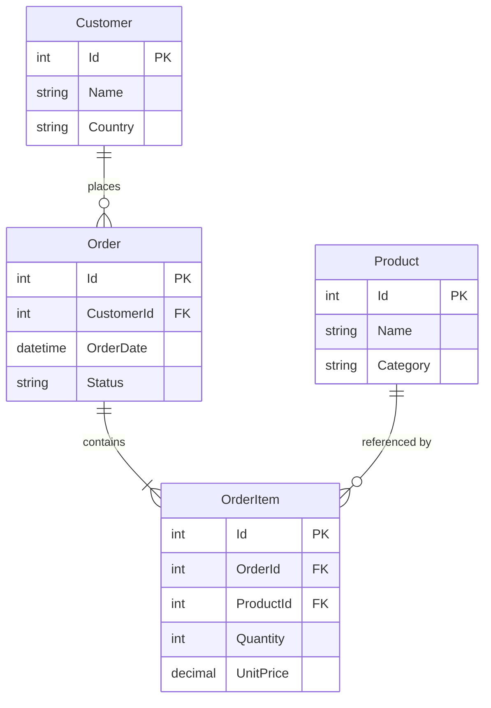

# Data Model: NL-to-SQL Sales Chatbot PoC

**Feature**: `001-nl-to-sql-chatbot` | **Date**: 2026-05-18

## Overview

Four relational tables (constitution maximum) model a simplified sales domain. EF Core 8 owns schema via migrations and seed data. LLM-generated queries read these tables exclusively via validated SELECT statements executed in `SqlExecutionService`.

## Entity Relationship



## Tables

### Customer

| Column | Type | Constraints | Notes |
|--------|------|-------------|-------|
| Id | int | PK, identity | Surrogate key |
| Name | nvarchar(200) | NOT NULL | Display name |
| Country | nvarchar(100) | NOT NULL | ISO-style country name (e.g., Germany, France) |

**Validation**: Name and Country required on seed/insert (EF only; no user writes in PoC).

**Usage**: Geographic filters, customer counts, order joins for country-scoped questions.

---

### Product

| Column | Type | Constraints | Notes |
|--------|------|-------------|-------|
| Id | int | PK, identity | Surrogate key |
| Name | nvarchar(200) | NOT NULL | Product display name |
| Category | nvarchar(100) | NOT NULL | e.g., Electronics, Furniture |

**Validation**: Name and Category required.

**Usage**: Best-seller analysis, category filters, product listings.

---

### Order

| Column | Type | Constraints | Notes |
|--------|------|-------------|-------|
| Id | int | PK, identity | Surrogate key |
| CustomerId | int | FK → Customer.Id | Purchaser |
| OrderDate | datetime2 | NOT NULL | UTC or local consistent in seed |
| Status | nvarchar(50) | NOT NULL | Includes `Completed`, `Pending`, `Cancelled`, etc. |

**Validation**: CustomerId must reference existing Customer.

**Business rules**:
- **Order counts** (FR-014): include all statuses unless user explicitly filters.
- **Revenue gate** (FR-013): revenue calculations join OrderItems only where `Status = 'Completed'`.

**Indexes** (recommended): `OrderDate`, `Status`, `CustomerId` for typical NL filters.

---

### OrderItem

| Column | Type | Constraints | Notes |
|--------|------|-------------|-------|
| Id | int | PK, identity | Surrogate key |
| OrderId | int | FK → Order.Id | Parent order |
| ProductId | int | FK → Product.Id | Product sold |
| Quantity | int | NOT NULL, > 0 | Units purchased |
| UnitPrice | decimal(18,2) | NOT NULL, ≥ 0 | Price at time of order |

**Computed (application/LLM, not stored)**: LineTotal = `Quantity * UnitPrice`

**Validation**: Quantity > 0; UnitPrice ≥ 0; FK integrity.

**Usage**: Revenue sums, quantity sold, best-seller ranking.

---

## Relationships

| From | To | Cardinality | FK |
|------|-----|-------------|-----|
| Customer | Order | 1:N | Order.CustomerId |
| Order | OrderItem | 1:N | OrderItem.OrderId |
| Product | OrderItem | 1:N | OrderItem.ProductId |

No many-to-many join tables (keeps table count at 4).

## Seed Data Requirements

Seed script must support acceptance scenarios:

| Scenario | Data requirement |
|----------|------------------|
| Order count last 30 days | Orders spanning last 30+ days; known count (~142 in examples) |
| Germany filter | Multiple customers/orders from Germany |
| Revenue Completed-only | Mix of Completed / Pending / Cancelled; revenue excludes non-Completed |
| Best seller | OrderItems with varying quantities per product |
| Electronics category | Products in Electronics with order lines |
| Zero-result queries | Countries with no orders (e.g., France optional) for empty-result UX |

Currency: seed `UnitPrice` values treated as **EUR** for display (spec assumption).

## In-Memory Session Model (not persisted)

### ConversationSession

| Field | Type | Notes |
|-------|------|-------|
| Exchanges | `List<ChatExchange>` | Ordered chronologically |
| MaxExchanges | const 10 | Oldest removed when exceeded |

### ChatExchange

| Field | Type | Notes |
|-------|------|-------|
| UserMessage | string | Raw user input |
| AssistantMessage | string | Final plain-language reply |
| CreatedAt | DateTimeOffset | Optional; for debugging |

**Lifecycle**: Created on first message; cleared on `Reset()` or new Blazor circuit (refresh).

## Application DTOs (non-EF)

### QueryResult

| Field | Type | Notes |
|-------|------|-------|
| ColumnNames | `IReadOnlyList<string>` | From reader schema |
| Rows | `IReadOnlyList<IReadOnlyDictionary<string, object?>>` | Max 500 |
| RowCount | int | `Rows.Count` |

### SqlGenerationResult

| Field | Type | Notes |
|-------|------|-------|
| IsSuccess | bool | false when CANNOT_ANSWER |
| Sql | string? | Validated SELECT when success |
| FailureReason | string? | Internal logging; not shown raw to user |

## State Transitions

### Order.Status (seed values only; no writes at runtime)

```text
Pending → Completed | Cancelled
```

PoC does not mutate status; LLM reads current values only.

### Conversation session

```text
Empty → Active (first message)
Active → Active (append exchange; trim to 10)
Active → Empty (New Chat / Reset / circuit disconnect)
```

## EF Core Configuration Notes

- `SalesDbContext` exposes `DbSet<>` for all four entities.
- Fluent API configures FK relationships and decimal precision on `UnitPrice`.
- Migrations live under `Data/Migrations/`.
- Seeding invoked on startup in Development or via `dotnet run --seed` flag (implementation detail in tasks).

## Constitution Alignment

| Rule | Compliance |
|------|------------|
| ≤ 4 tables | Exactly 4 domain tables |
| EF for schema | Migrations + seed via EF Core |
| Raw SQL | Only LLM SELECT in SqlExecutionService |
| Revenue rule | Documented for prompts; not DB constraint |
| No chat persistence | Session in memory only (FR-006) |
