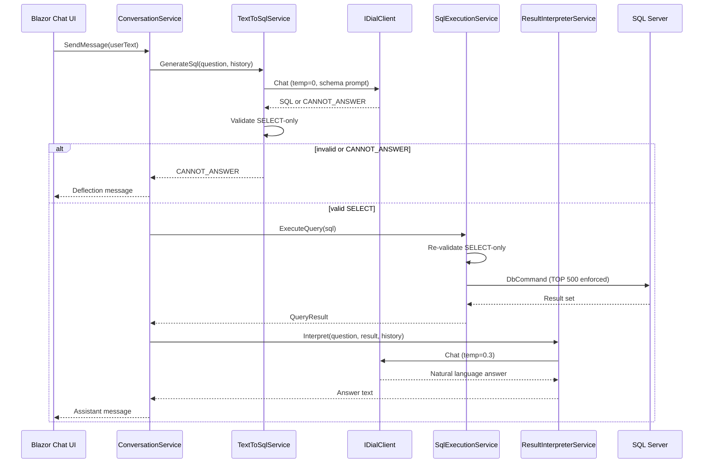

# Implementation Plan: NL-to-SQL Sales Chatbot PoC

**Branch**: `001-nl-to-sql-chatbot` | **Date**: 2026-05-18 | **Spec**: [spec.md](./spec.md)

**Input**: Feature specification from `/specs/001-nl-to-sql-chatbot/spec.md`

**Note**: This template is filled in by the `/speckit-plan` command. See `.specify/templates/plan-template.md` for the execution workflow.

## Summary

Build a single-host .NET 8 web application (Blazor Server UI + Minimal API) that lets non-technical users ask plain-English questions about a four-table sales database (Orders, Customers, Products, OrderItems). The pipeline is: **ConversationService** orchestrates **TextToSqlService** (DIAL, temp 0) → dual SELECT validation → **SqlExecutionService** (raw `DbCommand`, 500-row cap) → **ResultInterpreterService** (DIAL, temp 0.3) → natural-language reply. Session context is in-memory per browser circuit with a **10-exchange history cap**; **New Chat** and browser refresh reset context. Out-of-scope or unsafe questions return **`CANNOT_ANSWER`** or a user-facing deflection message.

## Technical Context

**Language/Version**: C# / .NET 8

**Primary Dependencies**: ASP.NET Core Minimal API, Blazor Server, Entity Framework Core 8, Microsoft.Data.SqlClient, EPAM DIAL (OpenAI-compatible HTTP API, GPT-4o)

**Storage**: SQL Server LocalDB (development) via EF Core 8 migrations and seed data; in-memory session state for chat history (not persisted)

**Testing**: xUnit, NSubstitute, FluentAssertions; integration tests skip gracefully when SQL Server is unavailable

**Target Platform**: Windows/macOS/Linux developer machines; GitHub Actions `ubuntu-latest` for CI build/test/format

**Project Type**: Single-solution web application (Blazor Server + Minimal API in one host project)

**Performance Goals**: 95% of in-scope questions respond within 10 seconds under PoC load (SC-004); single concurrent demo user / small team

**Constraints**: ≤ 4 DB tables; SELECT-only LLM SQL; 500-row execution cap; 10-exchange LLM history cap; no auth; EUR currency display; constitution async/cancellation rules

**Scale/Scope**: One deployable web app; four domain tables; five application service interfaces; curated seed dataset for demo Q&A

## Constitution Check

*GATE: Must pass before Phase 0 research. Re-check after Phase 1 design.*

Reference: `.specify/memory/constitution.md` (ai-upskilling-poc v1.0.0)

- [x] **Simplicity**: 1 deployable service (Blazor host); 4 DB tables (Orders, Customers, Products, OrderItems); no speculative features
- [x] **SQL safety**: SELECT-only validation in `TextToSqlService` AND `SqlExecutionService`; `CANNOT_ANSWER` sentinel; max 500 rows enforced at execution
- [x] **Testing**: all five services behind interfaces; NSubstitute + FluentAssertions; integration tests skip when DB absent
- [x] **Async**: no blocking on tasks; `CancellationToken` on all public service/API methods
- [x] **Data access**: EF Core 8 for migrations/seeding; raw `DbCommand` only in `SqlExecutionService` for validated LLM SQL
- [x] **LLM**: all DIAL via `IDialClient`; temperature 0 (SQL) / 0.3 (interpretation)
- [x] **CI**: GitHub Actions runs `dotnet build`, `dotnet test`, `dotnet format --verify-no-changes`; one spec directory per PR

If any gate fails, document justification in **Complexity Tracking** or reduce scope before proceeding.

## Project Structure

### Documentation (this feature)

```text
specs/001-nl-to-sql-chatbot/
├── plan.md              # This file (/speckit-plan command output)
├── research.md          # Phase 0 output (/speckit-plan command)
├── data-model.md        # Phase 1 output (/speckit-plan command)
├── quickstart.md        # Phase 1 output (/speckit-plan command)
├── contracts/           # Phase 1 output (/speckit-plan command)
└── tasks.md             # Phase 2 output (/speckit-tasks command - NOT created by /speckit-plan)
```

### Source Code (repository root)

```text
SalesChatbot.sln
src/
  SalesChatbot/
    Program.cs                    # Host: Blazor Server + Minimal API + DI
    SalesChatbot.csproj
    appsettings.json
    appsettings.Development.json
    Api/
      ChatEndpoints.cs            # POST /api/chat/message, POST /api/chat/new
    Components/
      App.razor
      Layout/
      Pages/
        Chat.razor                # Chat UI + New Chat button
      Chat/
        MessageList.razor
        ChatInput.razor
    Data/
      SalesDbContext.cs
      Entities/
        Order.cs
        Customer.cs
        Product.cs
        OrderItem.cs
      Migrations/
      Seed/
        SalesDataSeeder.cs
    Infrastructure/
      Dial/
        DialClient.cs             # IDialClient implementation
        DialOptions.cs
        DialChatRequest.cs
    Models/
      ChatExchange.cs
      ConversationSession.cs
      QueryResult.cs
      SqlGenerationResult.cs
    Services/
      Interfaces/
        IDialClient.cs
        ITextToSqlService.cs
        ISqlExecutionService.cs
        IResultInterpreterService.cs
        IConversationService.cs
      ConversationService.cs
      TextToSqlService.cs
      SqlExecutionService.cs
      ResultInterpreterService.cs
      Validation/
        SqlSafetyValidator.cs     # Shared SELECT-only rules (both layers)
    wwwroot/
      css/
tests/
  SalesChatbot.UnitTests/
    Services/
    Validation/
  SalesChatbot.IntegrationTests/
    ChatFlowTests.cs              # Skip when DB unavailable
    SqlServerFactAttribute.cs
.github/
  workflows/
    ci.yml
```

**Structure Decision**: Single `SalesChatbot` host project keeps the PoC within the ≤ 5 deployable-services limit. Blazor components call `IConversationService` in-process; Minimal API endpoints mirror the same service for integration tests and contract documentation. Shared `SqlSafetyValidator` enforces dual-boundary SELECT validation per constitution.

## Architecture Overview



### Service Responsibilities (all Scoped DI)

| Interface | Responsibility |
|-----------|----------------|
| `IDialClient` | Sole HTTP gateway to EPAM DIAL OpenAI-compatible chat completions |
| `ITextToSqlService` | Build SQL-generation prompt (schema + business rules + history); temp=0; validate SELECT; return SQL or `CANNOT_ANSWER` |
| `ISqlExecutionService` | Re-validate SELECT; enforce 500-row cap; execute via `DbConnection.CreateCommand()` |
| `IResultInterpreterService` | Format `QueryResult` into plain language; temp=0.3; handle zero rows and multi-row summaries |
| `IConversationService` | Session state, 10-exchange cap, orchestrate pipeline, map `CANNOT_ANSWER` to user-facing deflection |

### LLM Policy

| Stage | Temperature | Output |
|-------|-------------|--------|
| SQL generation | 0 | Valid T-SQL `SELECT` or exact sentinel `CANNOT_ANSWER` |
| Result interpretation | 0.3 | Plain-language answer (EUR for currency, count + top-5 summary for multi-row) |

History sent to both LLM calls: up to **10 prior exchanges** (user + assistant pairs); oldest dropped when cap exceeded.

### Session & Reset

- `ConversationSession` held in scoped service state (one per Blazor circuit / API request scope with session id header for API tests).
- **New Chat** button calls `IConversationService.Reset()` clearing exchanges.
- Browser refresh creates a new circuit → new scoped session (FR-016).

## Complexity Tracking

> **Fill ONLY if Constitution Check has violations that must be justified**

| Violation | Why Needed | Simpler Alternative Rejected Because |
|-----------|------------|-------------------------------------|
| _(none)_ | — | — |

## Post-Design Constitution Re-Check

After Phase 1 design (data-model.md, contracts/):

- [x] Table count remains 4 (Orders, Customers, Products, OrderItems)
- [x] No additional deployable services introduced
- [x] Dual validation and raw SQL isolation unchanged
- [x] All external LLM access remains behind `IDialClient`
