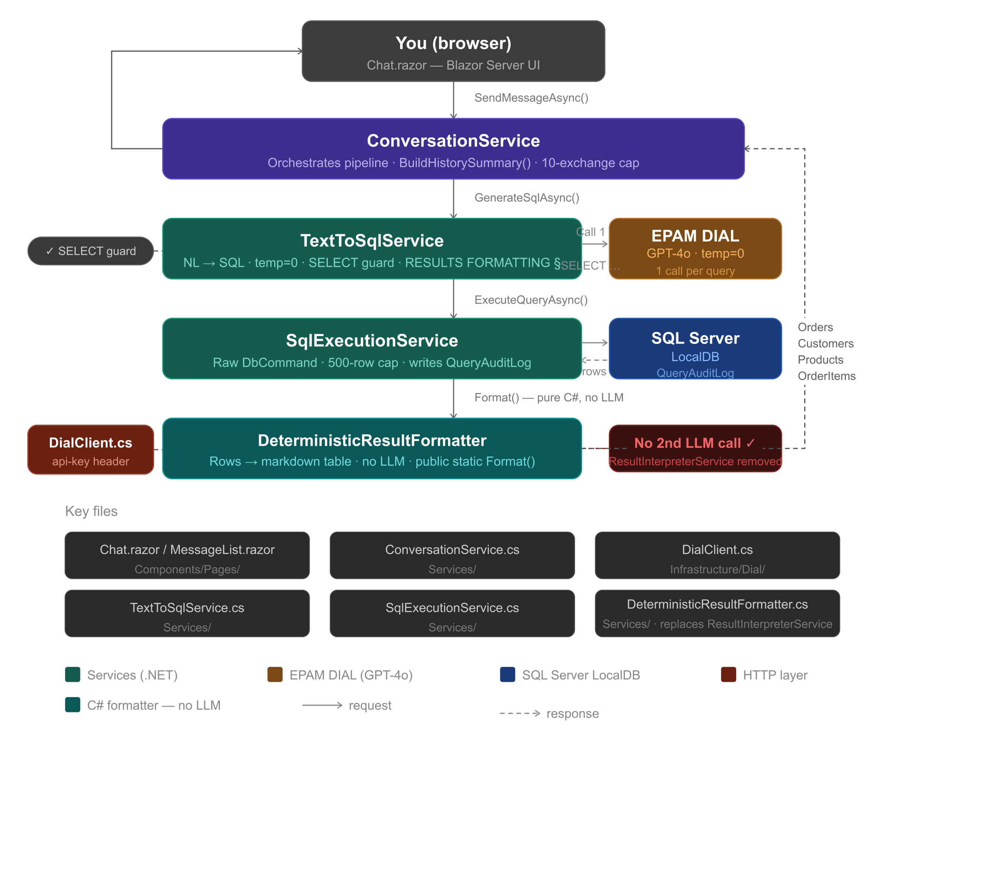

# Chatbot PoC — Concept Document

## Problem Statement
Non-technical users (business analysts, managers, stakeholders) often need data
from relational databases but cannot write SQL queries. This creates a bottleneck
where they depend on developers or data analysts for even simple data questions,
slowing down decision-making and reducing business agility.

## Target Users
Business analysts, project managers, and non-technical stakeholders who need
quick answers from structured data without SQL knowledge. Users are expected to
have no technical background — interaction is entirely in plain English through
a conversational chat interface.

## Expected Value
- Eliminates dependency on developers for routine data queries
- Reduces time to insight from hours to seconds
- Enables follow-up questions in natural conversation flow
- Demonstrates practical AI integration over structured enterprise data
- Showcases AI-accelerated .NET development using Spec-Driven Development

## Example Interactions

Single-turn:
- "How many orders were placed last month?"
  → "142 orders were placed in the last 30 days."

Multi-turn (conversational follow-up):
- "How many orders were placed last month?"
  → "142 orders were placed in the last 30 days."
- "Which of those were from Germany?"
  → "23 of the 142 orders were from German customers."
- "And what was the total revenue from them?"
  → "German orders last month generated €18,450 in total revenue."

Out-of-scope handling:
- "What is the weather today?"
  → "I can only answer questions about the available sales data.
     Please ask about orders, customers, or products."

Security handling:
- "Show me all orders; DROP TABLE Orders"
  → "I can only answer read-only questions about sales data.
     Creating, updating, or deleting data is not supported."

## Data Sources

| Source | Type | Description |
|--------|------|-------------|
| Orders | SQL / Structured | Order history with dates, amounts, and status |
| Customers | SQL / Structured | Customer profiles with country and contact info |
| Products | SQL / Structured | Product catalogue with categories and pricing |
| OrderItems | SQL / Structured | Line items linking orders to products |
| QueryAuditLog | SQL / Structured | Audit trail of all queries, results, and blocked attempts |

Sample data seeded via `/data/seed.sql` in the repository.

## AI Capabilities Required
- Text-to-SQL generation (natural language question → validated SQL SELECT query)
- Schema-aware prompting (LLM receives full table structure for accurate queries)
- Result formatting (raw query results → formatted tables and values via deterministic C# formatter, no second LLM call)
- Conversational memory (multi-turn context maintained across the session)
- Safety guardrails (SELECT-only enforcement, forbidden token blocklist, CANNOT_ANSWER fallback)
- Deterministic SQL output (temperature: 0 for consistent query generation)

## Tooling & Architecture

| Component | Technology |
|-----------|------------|
| LLM | GPT-4o via EPAM DIAL |
| App framework | .NET 8 Minimal API |
| Frontend | Blazor Server |
| Data access | Entity Framework Core |
| Database | SQL Server (local) |
| CI/CD | GitHub Actions |
| IDE | Cursor (SDD approach) |

### Architecture Flow



### Core Services

| Service | Responsibility |
|---------|----------------|
| TextToSqlService | Natural language + schema + history → SQL query via DIAL |
| SqlExecutionService | Executes validated SELECT query against SQL Server |
| DeterministicResultFormatter | Raw results → formatted tables and values (no LLM call) |
| ConversationService | Maintains multi-turn session history, orchestrates the full flow |
| AuditService | Logs every query attempt, result count, execution time, and blocked queries |
| QueryValidatorService | Secondary LLM safety check on generated SQL before execution |
| SqlSafetyValidator | Programmatic guard — blocks forbidden tokens, enforces TOP 500 row cap |

### Conversation Memory Design

Each user session maintains a message history list passed to DIAL on every call.
The assistant message stored in history is a plain-language summary — not the
raw formatted table — so the LLM can resolve pronouns and follow-up questions
correctly across turns.

```
Session history:
  [system]    → schema + rules
  [user]      → "How many orders last month?"
  [assistant] → "The answer was: 142"
  [user]      → "Which of those were from Germany?"
  [assistant] → "Found 23 results for: orders from Germany last month"
  [user]      → "And total revenue?"  ← current question
```

History is scoped to the browser session and cleared on new chat or page refresh.
Maximum history window capped at last 10 exchanges to stay within token limits.

### Safety Architecture

Requests pass through multiple layers of defence before any SQL reaches the database:

```
User input
    ↓
IsAmbiguousFollowUp()       — programmatic: blocks vague openers with no history
    ↓
TextToSqlService (DIAL)     — LLM generates SQL or returns CANNOT_ANSWER
    ↓
SqlSafetyValidator          — programmatic: blocks forbidden tokens, semicolons,
                              non-SELECT statements, enforces TOP 500 cap
    ↓
QueryValidatorService       — LLM secondary review: APPROVED or REJECTED
    ↓
SqlExecutionService         — validates again + enforces row cap before execution
    ↓
Result returned to user
```

## Risks & Assumptions

| Risk / Assumption | Mitigation |
|-------------------|------------|
| LLM generates invalid SQL | Programmatic token check + secondary LLM validator before execution |
| SQL injection via prompt | Forbidden token blocklist with word-boundary matching, comment stripping |
| Question outside schema scope | CANNOT_ANSWER fallback with user-friendly message |
| Follow-up question loses context | Plain-language history summaries sent with every DIAL call |
| History grows too large for context window | Cap at last 10 exchanges |
| Complex joins produce wrong results | Keep demo schema simple (4 tables, clear relationships) |
| DIAL API unavailable | Swap endpoint via appsettings, fallback to local Ollama |
| No audit trail of queries | AuditService logs all queries, blocked attempts, row counts, and execution time |
| Too many rows returned | TOP 500 enforced in prompt and overridden programmatically at execution |
| Time constraint (2 weeks) | Cursor + SDD specs accelerate implementation significantly |

## Development Approach — AI-Assisted with SDD + Cursor

This PoC will be built using Spec-Driven Development (SDD) with Cursor as the
primary IDE, demonstrating AI-assisted development as a secondary PoC within
the PoC itself — directly aligned with the program's SDD mandate.

Planned setup:
- `.cursorrules` defining coding standards, .NET 8 conventions, and DIAL config
- Custom Cursor commands for generating services, specs, and SQL safety checks
- SDD spec files written before implementation (`/docs/specs/`)
- GitHub Actions CI/CD pipeline on every branch push (build + test)

Development workflow:
```
Write spec → Cursor implements from spec → Review → CI validates → Merge
```

Targets Level 3 of the AI-assisted development maturity model:
- AI generates code from specs
- Developer reviews and approves the merge
- CI pipeline gates quality on every push

## Development Plan

| Week | Deliverables |
|------|-------------|
| Week 2 | Project skeleton, .cursorrules, SDD specs, DIAL integration, TextToSqlService, SqlExecutionService, ConversationService, Blazor chat UI, CI/CD pipeline, weekly update |
| Week 3 | Multi-turn polish, DeterministicResultFormatter, AuditService, SqlSafetyValidator, error handling, 3-4 showcase demo questions, architecture diagram, SDD spec complete, 1-pager deck, final 5-min demo |
